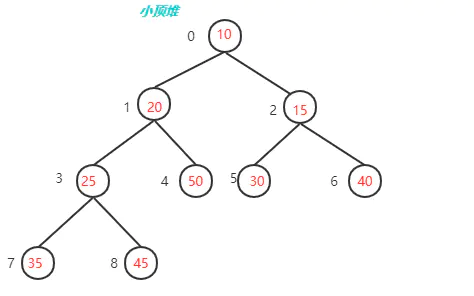
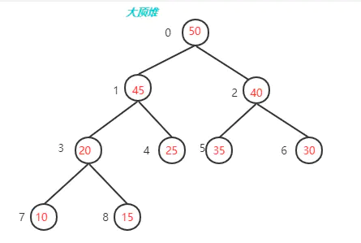

## Double Check
```java
class Foo {
    private Helper helper;
    public Helper getHelper() {
        if (helper == null) {
            synchronized(this) {
                if (helper == null) {
                    helper = new Helper();                    
                }
            }
        }
        return helper;
    }
}
```

```go
// package: sync.once
func (o *Once) Do(f func()) {
    // Note: Here is an incorrect implementation of Do:
    //
    //	if atomic.CompareAndSwapUint32(&o.done, 0, 1) {
    //		f()
    //	}
    //
    // Do guarantees that when it returns, f has finished.
    // This implementation would not implement that guarantee:
    // given two simultaneous calls, the winner of the cas would
    // call f, and the second would return immediately, without
    // waiting for the first's call to f to complete.
    // This is why the slow path falls back to a mutex, and why
    // the atomic.StoreUint32 must be delayed until after f returns.

    if atomic.LoadUint32(&o.done) == 0 {
    	// Outlined slow-path to allow inlining of the fast-path.
    	o.doSlow(f)
    }
}

func (o *Once) doSlow(f func()) {
    o.m.Lock()
    defer o.m.Unlock()
    if o.done == 0 {
        defer atomic.StoreUint32(&o.done, 1)
        f()
    }
}
```

### Design Pattern
`装饰者(Decorator or Wrapper)` | `单例(Singleton)` | `模板方法(Template Method)`

### Domain Primitive
[Domain Primitive 详解](https://developer.aliyun.com/article/716908)


## 小顶堆 | 大顶堆 | TopK


