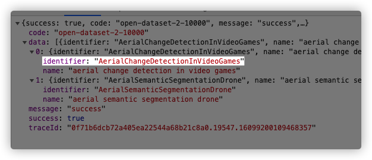

### 优点
1. 支持所有字符集。
2. 查询很快。

### 缺点
暂时没有缺点？

### 新需求
现在我们可以根据datasetName进行前缀检索。

假设我们的需求变了 => 检索到datasetName后，必须同时返回identifier；词频越高在结果中越靠前。

#### 方案一：拿到名字后再批量查询一次数据库，然后根据词频排序。

##### 弊端
1. 响应慢。

### 反思一下现在的设计
1. Node本身是一个数据结构，就像数组、字典一样。在这里却和datasetName绑定在一起了，耦合非常严重。
2. 无法在Node中承载更多信息(比如词频)，只能是一个字符串。
3. Node不能复用了（比如对标签进行前缀匹配），就像为datasetName量身定做一样。而任何一个数据结构都应该是可以复用的。

### 更好的设计

##### 重新审视TrieTree

一个数据容器，可以往里面放很多种对象，只要满足特定的格式就行。

1. 前缀匹配树
2. 和dict、array一样，是基础容器，没有biz概念。

特定格式：
1. 有value
2. 有频率？还不够抽象(热度)，本质是`可比较的`。